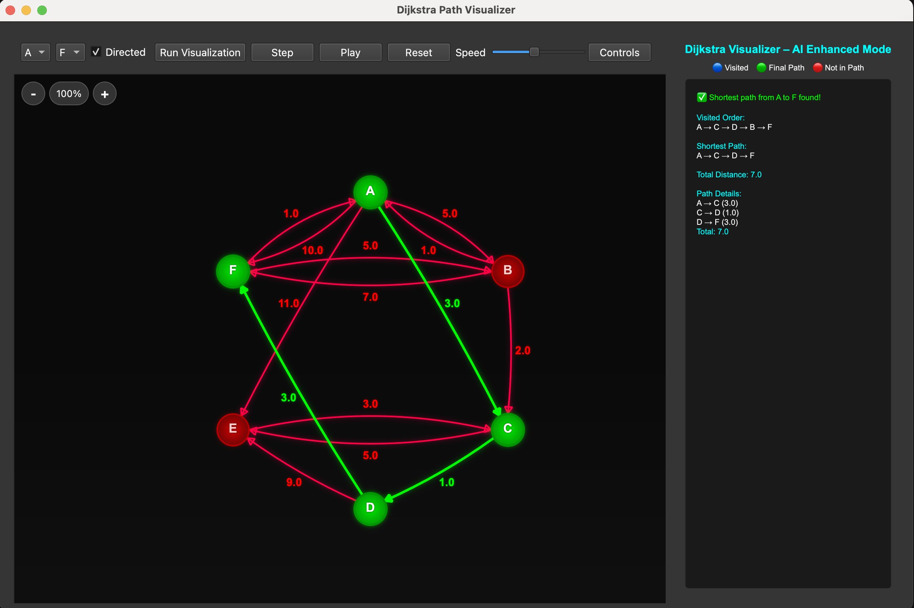
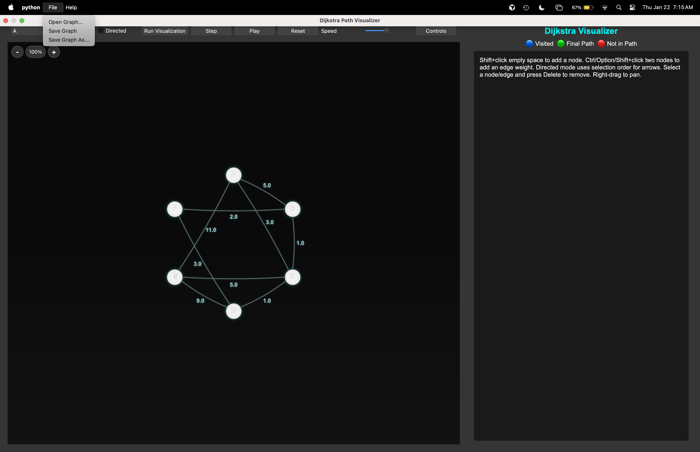

# Dijkstra Path Visualizer

> Interactive visualization tool for Dijkstra's shortest path algorithm built with PyQt6

[](https://python.org)
[](https://pypi.org/project/PyQt6/)
[](LICENSE)

A PyQt6-based interactive visualization tool for Dijkstra's shortest path algorithm. Watch the algorithm explore your graph step-by-step and find the optimal path.

## Demo

<!-- Add your video here -->
<!-- Example:  -->
<!-- Or embed YouTube: [](https://www.youtube.com/watch?v=VIDEO_ID) -->

## Features

### Graph Visualization
- **Interactive graph canvas** with draggable nodes
- **Zoom controls** (+/- buttons and mouse wheel)
- **Responsive layout** that scales with window size
- **Glow effects** for a modern, polished look

### Algorithm Visualization
- **Step-by-step animation** of Dijkstra's algorithm
- **Play/Pause/Step controls** for detailed exploration
- **Adjustable speed** slider
- **Color-coded feedback**:
  - Green: Final shortest path
  - Cyan: Visited nodes during exploration
  - Red: Nodes/edges not in the final path



### Graph Editing
- **Add nodes**: Shift + click on empty space
- **Add edges**: Ctrl/Option/Shift + click two nodes, then enter weight
- **Remove nodes/edges**: Select and press Delete
- **Edit edge weights**: Double-click on edge or weight label
- **Rename nodes**: Double-click on node
- **Drag nodes**: Click and drag to reposition
- **Pan view**: Right-click and drag

### Graph Modes
- **Undirected mode**: Edges work both directions with same weight
- **Directed mode**: Edges are one-way; add reverse edges for bidirectional paths with different weights


### Save and Load JSON Graphs
- **Save graphs** to JSON files (File > Save Graph)
- **Load graphs** from JSON files (File > Open Graph)
- Preserves node positions, labels, edge weights, and directed/undirected mode



## Installation

### Prerequisites
- Python 3.10+
- pip

### Setup
1. Clone the repository
2. Create and activate a virtual environment:
```bash
python -m venv .venv
source .venv/bin/activate
```
3. Install dependencies:
```bash
pip install -r requirements.txt
```

## Usage

Run the application:
```bash
python main.py
```

### Alternative entry point
```bash
python -m dijkstra_dashboard
```

### Quick Start
1. Select start and target nodes from the dropdown menus
2. Click "Run Visualization" to watch Dijkstra's algorithm find the shortest path
3. Use "Step" to advance one step at a time
4. Use "Reset" to clear the visualization

### Optional (editable install)
```bash
pip install -e .
dijkstra-ui
```

### Tests
```bash
pytest
```

## Project Structure

```
.
├── main.py                           # Entry point
├── pyproject.toml                    # Package configuration
├── pytest.ini                        # Test configuration
├── requirements.txt                  # Dependencies
├── img/                              # Screenshots
├── examples/                         # Example graph JSON files
├── lessons/
│   └── shortest_path.py              # Algorithm explanation
├── tests/
│   └── core/                         # Unit tests
├── src/
│   └── dijkstra_dashboard/
│       ├── __main__.py               # Package entry point
│       ├── config.py                 # Configuration
│       ├── core/
│       │   ├── graph.py              # Graph data structure
│       │   ├── dijkstra.py           # Core algorithm
│       │   ├── algorithms/           # Algorithm framework
│       │   │   ├── dijkstra.py       # Dijkstra implementation
│       │   │   ├── runner.py         # Step-by-step execution
│       │   │   └── registry.py       # Algorithm registry
│       │   ├── layouts/              # Graph layout algorithms
│       │   │   ├── circle.py
│       │   │   ├── grid.py
│       │   │   └── spring.py
│       │   ├── serialization.py      # JSON save/load
│       │   ├── validation.py         # Input validation
│       │   └── errors.py             # Custom exceptions
│       └── ui/
│           ├── main_window.py        # Main application window
│           ├── graph_view.py         # Graph canvas widget
│           ├── graph_node.py         # Node rendering
│           ├── graph_edge.py         # Edge rendering
│           ├── controls_panel.py     # Playback controls
│           └── status_panel.py       # Status display
```

## Controls Reference

| Action | Input |
|--------|-------|
| Add node | Shift + click empty space |
| Add/edit edge | Ctrl/Option/Shift + click two nodes |
| Remove node/edge | Select + Delete |
| Rename node | Double-click node |
| Edit edge weight | Double-click edge |
| Move node | Drag node |
| Pan view | Right-click + drag |
| Zoom | +/- buttons or scroll wheel |

## License

MIT License - see [LICENSE](LICENSE) for details.
